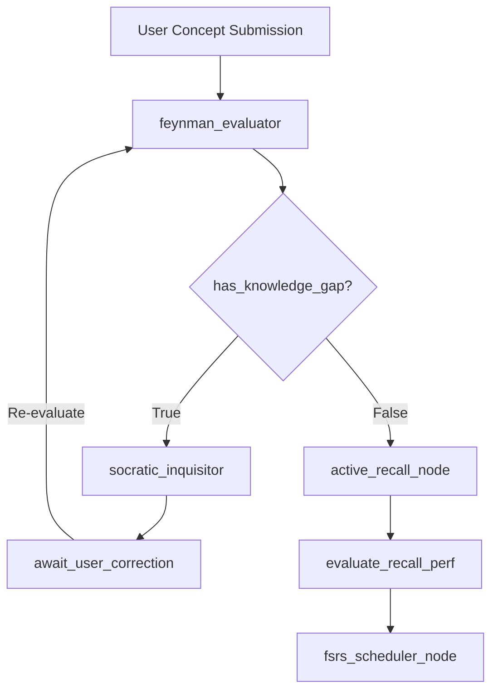

# NeuroLearner — Metacognitive Agent

## 1. System Overview

The **NeuroLearner** is an autonomous state-graph-based agent designed to facilitate active learning, metacognition, and long-term mnemonic retention. The system rejects the passive model of summaries and pre-packaged answers, acting as a Socratic interlocutor grounded in three core pillars of cognitive neuroscience:

1. **Feynman Technique (*Learning by Teaching*):** The student explains concepts in their own words; the agent detects empty jargon, circular reasoning, and logical leaps.
2. **Testing Effect (*Active Recall / Retrieval Practice*):** Stimulation of Long-Term Potentiation (LTP) via the formulation of situational challenges based on Bloom's Taxonomy.
3. **Spaced Repetition:** Mitigation of the Ebbinghaus forgetting curve through adaptive review scheduling via the **FSRS** (*Free Spaced Repetition Scheduler*) or **SM-2** algorithm.

---

## 2. System Architecture (LangGraph)

The flow is structured as a Cyclic State Machine (*StateGraph*) in **LangGraph**, ensuring iterative feedback and deterministic transition control.



---

## 3. State Schema (`AgentState`)

```python
from typing import Literal, TypedDict
from pydantic import BaseModel, Field

class ConceptMetadata(BaseModel):
    concept_id: str
    topic: str
    stability: float = Field(default=1.0, description="FSRS Stability factor (in days)")
    difficulty: float = Field(default=5.0, description="FSRS Difficulty (1.0 to 10.0)")
    reps: int = Field(default=0, description="Total successful reviews")
    lapses: int = Field(default=0, description="Total failures/re-explanations needed")
    last_review: str
    next_review: str

class GapAnalysis(BaseModel):
    has_gaps: bool
    missing_elements: list[str]
    detected_jargon: list[str]
    logical_leaps: list[str]
    confidence_score: float

class AgentState(TypedDict):
    topic: str
    user_explanation: str
    dialogue_history: list[dict[str, str]]
    concept_meta: ConceptMetadata
    gap_analysis: GapAnalysis | None
    current_challenge: str | None
    user_response: str | None
    recall_grade: Literal["Again", "Hard", "Good", "Easy"] | None
    next_step: Literal["socratic_loop", "active_recall", "schedule", "complete"]
```

---

## 4. Node Specification

### 4.1. `feynman_evaluator`

* **Function:** Analyze the user's explanation searching for superficiality, practical unanchored abstractions, or jargon lacking semantic support.
* **System Prompt:**

```text
You are a rigorous metacognitive evaluator. Your task is to deconstruct the explanation provided by the student on the defined topic.
Identify:
1. Technical jargon used as a crutch without elementary explanation.
2. Cause-and-effect leaps.
3. Incorrect premises or half-truths.
Strictly return a structured JSON following the GapAnalysis schema.

```

### 4.2. `socratic_inquisitor`

* **Function:** Generate a counter-example (*Reductio ad Absurdum*) or a practical scenario dilemma forcing the student to identify their own error without giving away the answer.
* **Output:** Open and challenging question injected into `dialogue_history`.

### 4.3. `active_recall_node`

* **Function:** Activated when the concept explanation reaches a satisfactory level (`has_gaps == False`). Formulates a high-level problem from Bloom's Taxonomy (Analysis, Evaluation, or Synthesis).
* **Format:** Does not formulate trivial multiple-choice questions; requires structured problem solving, hypothetical scenario debugging, or trade-off justification.

### 4.4. `fsrs_scheduler_node`

* **Function:** Maps the interaction performance (`recall_grade`) along the axes of mnemonic Difficulty ($D$) and Stability ($S$) to determine the next review date.

---

## 5. Spaced Repetition Mechanics (FSRS / SM-2)

The scheduling node uses the mathematical formulation of memory decay:

$$R(t) = \left(1 + \text{factor} \times \frac{t}{S}\right)^{-1}$$

Where:

* $R$: Desired mnemonic Retention probability (target: $90\%$).
* $S$: Memory Stability (time in days for $R$ to drop from $100\%$ to $90\%$).
* $t$: Elapsed time since the last review.

### Grade Transition Matrix

| Grade | Cognitive Meaning | Impact on Graph | Scheduling Action |
| --- | --- | --- | --- |
| **Again (1)** | Severe retrieval failure / Conceptual hallucination | Restarts the Socratic cycle | $S \leftarrow S \times 0.2$, `lapses += 1`, immediate review |
| **Hard (2)** | Successful retrieval, but with excessive effort | Keeps in the current challenge | $S \leftarrow S \times 1.2$, $D \leftarrow \min(D + 0.5, 10.0)$ |
| **Good (3)** | Solid and concise response within expectations | Finalizes the node | $S \leftarrow S \times 2.5$, calculated interval for $R=0.90$ |
| **Easy (4)** | Complete mastery with intuitive application of trade-offs | Finalizes the node | $S \leftarrow S \times 4.0$, $D \leftarrow \max(D - 0.5, 1.0)$ |

---

## 6. Configuration and Dependencies

### Environment Variables

```bash
LLM_API_KEY=...
LLM_MODEL=...
LLM_BASE_URL=...
PERSISTENCE_DB_PATH=... # default: ./data/neuro_learner.db

```

### Main Dependencies (`requirements.txt`)

```text
langgraph>=0.2.0
pydantic>=2.7.0
fsrs>=3.0.0

```

### State Persistence

The graph must instantiate a persistent checkpoint with LangGraph's `SqliteSaver`, ensuring that the student's progress and mental graph remain preserved across different terminal sessions or API calls.
